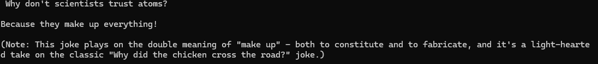

<<<<<<< HEAD
# SemanticKernel.Connectors.OnnxRuntimeGenAI
Semantic Kernel connector for ONNX models.

## How to use

### Prerequisites

ONNX models, for example `Phi-3 Mini-4K-Instruct`

````
git lfs install
git clone https://huggingface.co/microsoft/Phi-3-mini-4k-instruct-onnx
````


### Code

Create a new console app and add Nuget Package:

```
-- for CPU
feiyun0112.SemanticKernel.Connectors.OnnxRuntimeGenAI.CPU

-- for CUDA
feiyun0112.SemanticKernel.Connectors.OnnxRuntimeGenAI.CUDA
```

Then change Program.cs to:

````
Kernel kernel = Kernel.CreateBuilder()
           .AddOnnxRuntimeGenAIChatCompletion(
               modelPath: @"d:\Phi-3-mini-4k-instruct-onnx\cpu_and_mobile\cpu-int4-rtn-block-32-acc-level-4")
           .Build();

string prompt = @"Write a joke";

await foreach (string text in kernel.InvokePromptStreamingAsync<string>(prompt,
                   new KernelArguments(new OnnxRuntimeGenAIPromptExecutionSettings() { MaxLength = 2048 })))
{
    Console.Write(text);
}
````



## 使用说明

### 先决条件

你需要下载所需的ONNX模型，例如 `Phi-3 Mini-4K-Instruct

````
git lfs install
git clone https://hf-mirror.com/microsoft/Phi-3-mini-4k-instruct-onnx
````


### 示例代码

创建新的控制台应用，并根据你的硬件配置选择合适的Nuget包:

```
-- for CPU
feiyun0112.SemanticKernel.Connectors.OnnxRuntimeGenAI.CPU

-- for CUDA
feiyun0112.SemanticKernel.Connectors.OnnxRuntimeGenAI.CUDA
```

然后，只需几行代码，你就可以构建Kernel，并开始生成聊天内容:

````
Kernel kernel = Kernel.CreateBuilder()
           .AddOnnxRuntimeGenAIChatCompletion(
               modelPath: @"d:\Phi-3-mini-4k-instruct-onnx\cpu_and_mobile\cpu-int4-rtn-block-32-acc-level-4")
           .Build();

string prompt = @"Write a joke";

await foreach (string text in kernel.InvokePromptStreamingAsync<string>(prompt,
                   new KernelArguments(new OnnxRuntimeGenAIPromptExecutionSettings() { MaxLength = 2048 })))
{
    Console.Write(text);
}
````


=======
### Unity-SemanticKernel-SDK
# Test for Microsoft Semantic Kernel SDK for Unity Game engine .


it's just a simple copy past dlls for all individual 2.0 and 2.1 standard API so don't expect full support or successful deployment / runtime useage 


 I put it here for easy drag and drop 
check out .unity packages 


---


>>>>>>> origin/main
